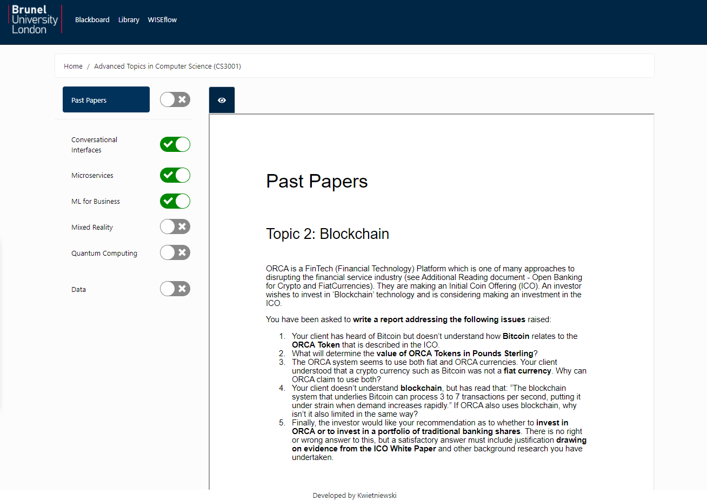

# BrunelExamHelper
#### Simple MERN stack application that allows for progress monitoring and viewing Google Doc documents in read only mode.

Require .env file in root directory with MONGO_URI env var.

Remember to end the link with correct db

e.g. "mongodb.net/Brunel"

### DEMO:

https://brunel-exams.herokuapp.com

